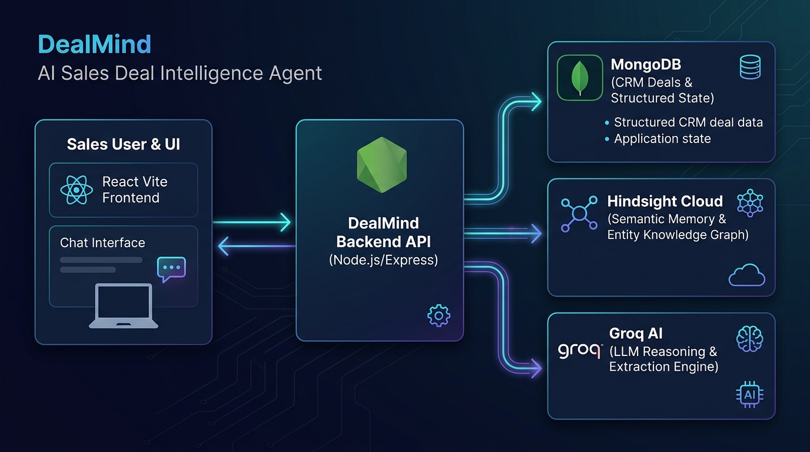

# DealMind — AI Sales Deal Intelligence Agent

## Problem

Sales representatives waste time reviewing CRM notes, emails, and meeting transcripts before speaking to a customer. Critical information — requirements, objections, pricing concerns, stakeholders, competitor mentions, commitments, and outcomes — gets lost across disjointed systems and memories. Every new interaction requires re‑learning the deal from scratch.

## Solution

DealMind is an AI‑powered sales assistant that creates **persistent memory** for every sales deal using **Hindsight**, a semantic memory system from Vectorize.io. The agent remembers the history of a deal, learns from each interaction, and uses those memories to provide increasingly personalized and useful responses.

Unlike a generic chatbot, DealMind’s core product is persistent deal memory: the agent knows little at first, information is learned and stored in Hindsight, and later interactions benefit from increasingly contextual, evidence‑based reasoning.

## Core Product Experience

1. **Create / select a customer/deal**
2. **View deal information** (stage, value, requirements, objections)
3. **Add a meeting / interaction** with notes
4. **Let the AI extract useful information** and store it in Hindsight
5. **Ask the AI questions** about the deal — the agent retrieves relevant memories and reasons over them
6. **Retrieve relevant memories** from Hindsight — visible in a “Memories Used” panel
7. **Generate personalized recommendations** and follow‑up emails — grounded in actual remembered data
8. **See the evolution of the deal** over time via a visual timeline
9. **Floating DealMind Chat** — draggable header to reposition anywhere on screen, with one-click enlarge/decrease buttons, step zoom (`-`/`+`), and corner resize handles

## Hindsight Integration

The application actually integrates Hindsight — not a fake vector database.

- **Retain**: Store conversations and notes; Hindsight automatically extracts facts, identifies entities, and builds a knowledge graph.
- **Recall**: Multi‑strategy search (semantic, keyword, graph, temporal) with RRF fusion returns ranked, structured facts.
- **Reflect**: Disposition‑aware reasoning (skepticism, literalism, empathy) produces contextual answers.
- **One bank per deal** — isolated memory containers; tags (`deal:<id>`) scope memories to the owning deal.

Key API surface used (via the official `@vectorize-io/hindsight-client` SDK):
- `client.retain(bankId, content, {context, timestamp, metadata, tags})` — stores memories with automatic fact extraction
- `client.recall(bankId, query, {budget, maxTokens, tags, types})` — returns ranked facts + observations
- `client.listMemories(bankId, {limit, q, type})` — list memories with filtering
- `client.createBank(bankId)` — creates an isolated memory bank per deal
- `client.reflect(bankId, query, {budget, responseSchema})` — disposition‑aware answer generation

## Tech Stack

| Layer | Technology |
|-------|------------|
| **Frontend** | React 19 + Vite + Tailwind CSS + React Router |
| **Backend** | Node.js + Express + Mongoose (MongoDB) |
| **Memory** | Hindsight (hosted cloud, `https://api.hindsight.vectorize.io`) |
| **LLM** | Groq `openai/gpt-oss-120b` (OpenAI‑compatible chat completions) |
| **Auth** | `Authorization: Bearer <hsk_…>` API key from `.env` |
| **Deployment** | Run locally (`npm run dev` + `npm run start`) |

## Installation

```bash
# 1. Clone / cd to project root
cd /path/to/dealmind

# 2. Install backend dependencies
cd backend && npm install

# 3. Install frontend dependencies
cd ../frontend && npm install

# 4. Configure environment variables
#    Copy .env.example to .env and fill in your keys:
#    cp .env.example .env
#    # Edit .env with your keys:
#    HINDSIGHT_API_KEY=hsk_your_key_from_hindsight_cloud
#    GROQ_API_KEY=gsk_your_groq_key

# 5. Start the backend
cd ../backend && npm run dev   # or: npm start

# 6. Start the frontend (in a separate terminal)
cd ../frontend && npm run dev

# 7. Open http://localhost:5173 (Vite default) — the proxy routes /api → http://localhost:4000
```

### `.env.example`

```dotenv
# Hindsight Cloud API key (starts with hsk_, obtained from https://ui.hindsight.vectorize.io)
HINDSIGHT_API_KEY=hsk_your_api_key_here

# Groq API key (from https://groq.com/console)
GROQ_API_KEY=gsk_your_groq_key_here

# Optional: custom endpoints
HINDSIGHT_URL=https://api.hindsight.vectorize.io
LLM_BASE_URL=https://api.groq.com/openai/v1

# Optional: port overrides
PORT=4000
```

## Architecture Diagram



```mermaid
flowchart TD
    A[Sales Representative] -->|UI interactions| B[DealMind Frontend (React + Vite)]
    B -->|REST API (JSON)| C[DealMind Backend (Node + Express)]
    C -->|MongoDB CRUD| D[(MongoDB)]
    C -->|Hindsight SDK| E[Hindsight Cloud (api.hindsight.vectorize.io)]
    E -->|Fact extraction, entity graph, recall| C
    C -->|Groq LLM| F[Groq (openai/gpt-oss-120b)]
    F -->|Reasoned answer| C
    C -->|Structured answer| B
    style E fill:#e3f2fd,stroke:#1976d2,stroke-width:2px
    style F fill:#e3f2fd,stroke:#1976d2,stroke-width:2px
```

## Memory Flow

```text
USER
  ↓
Frontend (add interaction, ask question)
  ↓
Backend API
  ↓
  1. Extract structured signals (LLM) → MongoDB
  2. Retain raw note in Hindsight → fact extraction, entity graph
  3. Recall relevant memories (multi‑strategy, RRF‑reranked)
  4. Combine: current request + deal state + retrieved memories
  5. LLM reasoning → personalized answer + memory citations
  ↓
Answer / recommendation / tool action
  ↓
New interaction → new memory in Hindsight → agent becomes increasingly knowledgeable
```

## Demo Sandbox & Pipeline Seeder

The application includes a **Demo Sandbox** (accessible from the left nav) that provisions realistic enterprise deals with historical interactions already retained in Hindsight. Options allow:

- **[Load Acme Demo (Solo)]** — wipes the DB and seeds Acme Technologies + retains 5 interactions in Hindsight.
- **[Seed All 8 Pipeline Deals]** — provisions all 8 diverse enterprise deals (FinTech, Cybersecurity, Aerospace, Healthcare, Logistics) with dedicated Hindsight memory banks.
- **[Reset All Deals & Banks]** — wipes MongoDB and safely clears the cloud memory banks.
- **[Ask DealMind]** — query the agent (brief, objections, strategy, history, follow‑up, risk).
- **[Add Meeting]** — log a new interaction (extracts structured facts + retains raw note).
- **[Show Memories]** — lists and searches Hindsight memories for any deal.

## Acceptance Test (proves memory works)

```text
1. Create Acme Technologies.
2. Add Interaction 1: "Customer is interested in Enterprise plan."
3. Add Interaction 2: "Customer is concerned about pricing."
4. Add Interaction 3: "CTO requires SOC 2 compliance."
5. Add Interaction 4: "Customer needs API integration."
6. Ask: "What should I discuss in my next meeting?"
   → The response MUST use these memories (pricing concern, SOC 2, API requirement).
7. Add: "Procurement has now made pricing the main blocker."
8. Ask the same question again.
   → The second response MUST reflect the new information.
9. The UI should show which memories were retrieved.
This proves the agent actually benefits from persistent memory.
```

## Before vs After Memory

| Without Memory | With Memory (DealMind) |
|---|---|
| Generic AI: "Discuss pricing and customer requirements." | DealMind: "Pricing remains the main unresolved blocker. Procurement is now involved. The CTO previously responded positively to the security discussion. Prioritize commercial negotiation while reinforcing the security value proposition." |

## Project Structure

```
dealmind/
├── backend/
│   ├── src/
│   │   ├── config.js           # env + key normalization (yhsk_ → hsk_)
│   │   ├── db.js               # mongoose connect
│   │   ├── models/             # Deal, Interaction, Activity
│   │   ├── services/
│   │   │   ├── llm.js          # Groq client + JSON extraction
│   │   │   ├── hindsight.js    # retain / recall / list / status
│   │   │   ├── extractor.js    # structured extraction schema + apply
│   │   │   └── agent.js        # askAgent(mode, useMemory, recall→prompt→JSON)
│   │   ├── routes/
│   │   │   ├── index.js        # router mount + 503 guard
│   │   │   ├── deals.js        # CRUD + dashboard data
│   │   │   ├── interactions.js # create + extract + retain
│   │   │   ├── agent.js        # /ask endpoint
│   │   │   ├── demo.js         # /demo/load, /demo/reset
│   │   │   └── health.js       # /api/health
│   │   └── seed/
│   │       └── seed.js         # npm run seed → create 5 deals + interactions
│   ├── package.json
│   └── .env.example
├── frontend/
│   ├── src/
│   │   ├── main.jsx            # ReactDOM.render
│   │   ├── App.jsx             # Router + navbar
│   │   ├── pages/
│   │   │   ├── Dashboard.jsx
│   │   │   ├── DealDetail.jsx
│   │   │   ├── AddInteraction.jsx
│   │   │   └── NotFound.jsx
│   │   ├── components/
│   │   │   ├── AiAssistant.jsx   # Dedicated AI tab with side-by-side memory compare
│   │   │   ├── ChatWidget.jsx    # Draggable, resizable floating deal chat
│   │   │   ├── MemoriesPanel.jsx # Retrieved memories chips with citation tags
│   │   │   ├── ModeButtons.jsx   # Preset mode buttons + memory toggles
│   │   │   ├── StatCard.jsx      # Dashboard metrics tile
│   │   │   └── DemoBar.jsx
│   │   └── index.css           # Tailwind + custom theming
│   ├── package.json
│   ├── vite.config.js
│   ├── tailwind.config.js
│   └── postcss.config.js
├── .env.example
├── README.md
└── architecture diagram (Mermaid in README)
```

## Running Locally (Full Stack)

```bash
# Backend
cd backend
npm install          # installs express, mongoose, @vectorize-io/hindsight-client, dotenv, body-parser
npm run dev          # node --watch src/index.js  (port 4000)

# Frontend
cd frontend
npm install          # installs react, react-dom, vite, @vitejs/plugin-react, tailwindcss
npm run dev          # vite (port 5173, proxies /api → localhost:4000)
```

Open http://localhost:5173. Use the **Demo Bar** → **[Load Acme Demo]** to see the full memory flow in seconds.

## Error Handling

- **Hindsight unavailable** → graceful degradation; routes return `{error, ok:false}`; UI shows "Memory unavailable" with reason.
- **LLM unavailable** → same; agent falls back to generic advice when `useMemory=false`.
- **MongoDB unavailable** → 503 with clear message; health endpoint still reports status.
- **Invalid API key** → 401 from Hindsight; caught and reported; app continues in degraded mode.
- **Malformed LLM output** → robust JSON parsing with fallback + retry; never crashes.
- **Never expose stack traces or secrets in the UI** — all errors are sanitized.

## Why Hindsight?

- **Actual persistent memory**, not a vector DB gimmick.
- **Official, documented API** — retain, recall, reflect, bank management.
- **Multi‑strategy retrieval** (semantic + keyword + graph + temporal, RRF fused).
- **Entity graph** — tracks stakeholders, competitors, commitments across interactions.
- **Disposition traits** — controllable skepticism/literalism/empathy for consistent agent tone.
- **Three memory types** — world facts, experience (conversations), observations (consolidated beliefs).

## Future Improvements

- Self‑hosted Hindsight instance (Docker) for complete data control.
- Observations mission customization per bank.
- MCP server integration for tool‑use extensions.
- Offline embeddings provider (sentence‑transformers) for air‑gapped deployments.
- Advanced directive system for hard constraints on agent behavior.
- Export/import of memory banks between deployments.
- Integration with common CRM systems (Salesforce, HubSpot) via sync jobs.